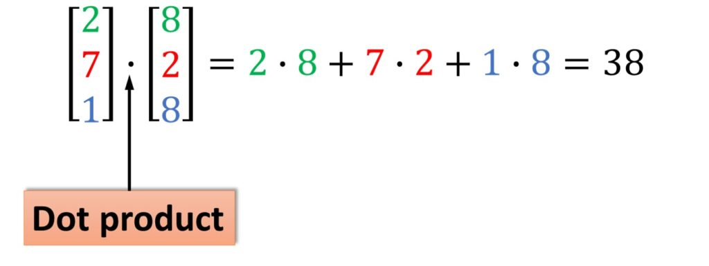

# Client_Server_C

It covers socket programming using multithreading in C.

# Working
The project consists of a client program that connects to 2 servers listening at PORT 1024 and 1025. The client distributes the two vectors equally to both servers and servers
compute dot product partially and sends their products to the client and client finally adds them both.

